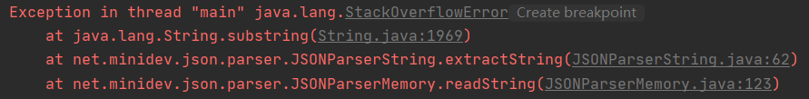

### [CVE ID]

CVE-2024-57699

### [Vulberbility Type]

Denial of Service (DoS)

### [Product]

Json-smart

### [Affected Versions]

2.5.0 through 2.5.1

### [Description]

Json-smart is a performance focused, JSON processor lib. A security issue was found in Json-smart 2.5.0 through 2.5.1. When loading a specially crafted JSON input, containing a large number of &rsquo;{&rsquo;, a stack exhaustion can be trigger, which could allow an attacker to cause a Denial of Service (DoS). This issue exists because of an incomplete fix for CVE-2023-1370.

### [Steps to Reproduce]

A PoC program are provided in this repository. 

When running the PoC program depending on an affected version of Json-smart, you will see the crash. 

 

When running the PoC program depending on an unaffected version, such as 2.4.11, you will see an output message that the crafted JSON input is properly handled by Json-smart.

